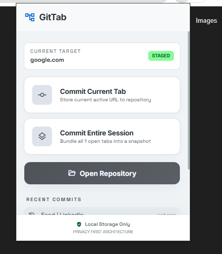
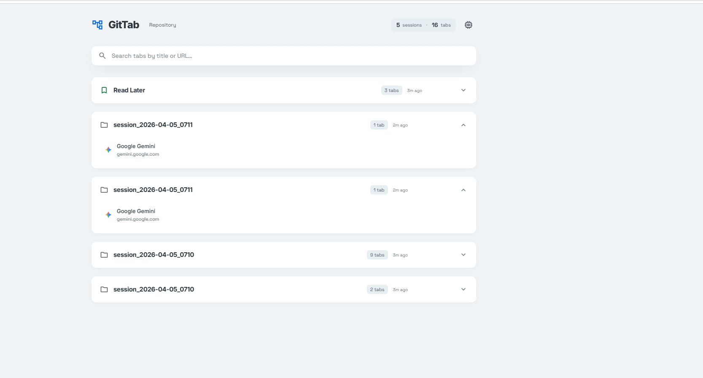

#  GitTab

**Save, organize, and restore your browser tabs like Git commits.**

GitTab is a lightweight, high-performance Chrome extension that solves tab overload and excessive memory consumption. Capture snapshots ("commits") of your open tabs, safely close them to free up system resources, and quickly restore them from a centralized, searchable dashboard.

---

## ✨ Features

### Popup Action Menu
- **Commit Current Tab** — Save the active tab to your "Read Later" list and close it instantly
- **Commit Entire Session** — Bundle all open tabs into a named snapshot and close them to free RAM
- **Open Repository** — Jump to the full dashboard to browse all your saved sessions

### Dashboard (The Repository)
- **Browse Sessions** — View all saved sessions as expandable cards with tab counts and timestamps
- **Real-time Search** — Filter across all sessions by tab title or URL in under 500ms
- **Restore** — Re-open a single tab or an entire session with one click
- **Rename & Delete** — Inline rename sessions, delete individual tabs or full sessions
- **Memory Management** — Discard inactive browser tabs to free RAM without closing them

### Privacy First
- 🔒 **100% local storage** — All data stays on your machine via `chrome.storage.local`
- 🚫 **No external requests** — Zero tracking, analytics, or remote databases
- 💤 **Zero background drain** — Service worker stays dormant when not in use

---

## 📸 Screenshots

<table>
  <tr>
    <td align="center"><strong>Popup</strong></td>
    <td align="center"><strong>Dashboard</strong></td>
  </tr>
  <tr>
    <td></td>
    <td></td>
  </tr>
</table>

---

## 🚀 Installation

### From Source (Developer Mode)

1. **Clone the repository**
   ```bash
   git clone https://github.com/your-username/git-tab.git
   ```

2. **Open Chrome Extensions**
   - Navigate to `chrome://extensions/`
   - Enable **Developer mode** (toggle in the top-right corner)

3. **Load the extension**
   - Click **"Load unpacked"**
   - Select the `git-tab` project directory

4. **Pin it** — Click the puzzle icon in Chrome's toolbar and pin GitTab for quick access

---

## 🏗️ Architecture

```
git-tab/
├── manifest.json              # Manifest V3 configuration
├── background.js              # Service worker (tab operations)
├── popup/
│   ├── popup.html             # Extension popup (350×480)
│   ├── popup.css              # Design system + popup styles
│   └── popup.js               # Popup interaction logic
├── dashboard/
│   ├── dashboard.html         # Full-page repository view
│   ├── dashboard.css          # Dashboard styles
│   └── dashboard.js           # Search, restore, delete logic
├── shared/
│   ├── storage.js             # Chrome storage API wrapper
│   └── utils.js               # Time formatting, ID gen, helpers
├── icons/                     # Extension icons (16, 48, 128px)
```

### Data Flow

```
┌─────────┐   sendMessage   ┌───────────────────┐   chrome.tabs   ┌─────────────┐
│  Popup   │ ──────────────▶ │ Background Worker  │ ──────────────▶ │ Browser Tabs │
└─────────┘                 └───────────────────┘                 └─────────────┘
                                     │
                            chrome.storage.local
                                     │
                                     ▼
┌───────────┐   direct access   ┌──────────┐
│ Dashboard │ ◀────────────────▶ │  Storage  │
└───────────┘                   └──────────┘
```

---

## 🎨 Design System

GitTab follows a custom design system called **"The Technical Manuscript"** — inspired by well-organized codebases, terminal aesthetics, and editorial design.

| Token | Description |
|---|---|
| **Typography** | Inter (headlines/body) + Space Grotesk (labels/technical data) |
| **Surfaces** | Tonal hierarchy — no hard borders, structure via background shifts |
| **Accent** | Green "commit pillar" (2px left bar on hover) |
| **Animations** | `cubic-bezier(0.2, 0, 0, 1)` — fast-in, minimal-out |
| **Borders** | "Ghost borders" at 15% opacity — whispers, not shouts |


---

## 📦 Data Model

All data is stored locally under a single key (`gittab_data`):

```json
{
  "sessions": [
    {
      "id": "sess_read_later",
      "name": "Read Later",
      "isPinned": true,
      "createdAt": 1712300000000,
      "tabs": [
        {
          "id": "tab_abc12345",
          "title": "Page Title",
          "url": "https://example.com",
          "favIconUrl": "https://example.com/favicon.ico",
          "addedAt": 1712300000000
        }
      ]
    }
  ]
}
```

---

## ⚙️ Permissions

| Permission | Why |
|---|---|
| `tabs` | Read URLs/titles, close tabs, discard inactive tabs |
| `storage` | Save tab data locally on the user's machine |
| `favicon` | Display website favicons in the dashboard |

---

## 🛠️ Tech Stack

- **Platform:** Chrome Manifest V3
- **Language:** Vanilla JavaScript (no frameworks, no build step)
- **Styling:** Vanilla CSS with custom properties (design tokens)
- **Storage:** `chrome.storage.local`
- **Fonts:** Google Fonts (Inter, Space Grotesk, Material Symbols)

---

## 🤝 Contributing

1. Fork the repository
2. Create a feature branch: `git checkout -b feature/my-feature`
3. Commit your changes: `git commit -m "Add my feature"`
4. Push to the branch: `git push origin feature/my-feature`
5. Open a Pull Request

---

## 📄 License

This project is licensed under the MIT License. See [LICENSE](LICENSE) for details.

---

<p align="center">
  <sub>Built with ❤️ for tab hoarders everywhere</sub>
</p>
